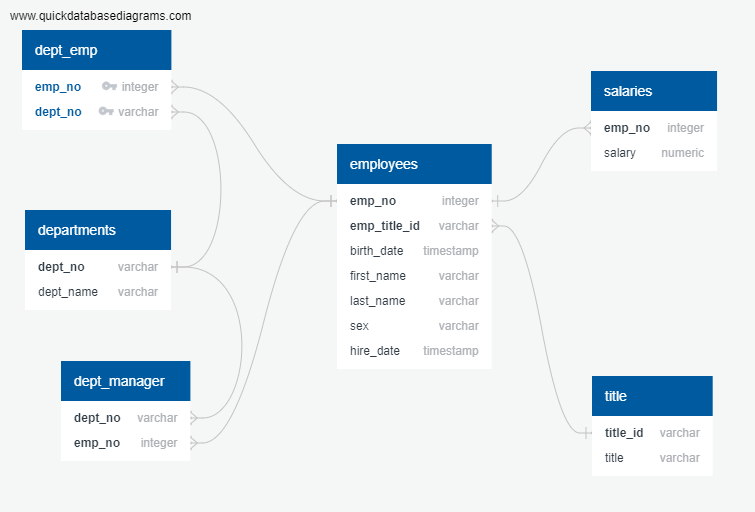

## Module 9 Challenge, 17 August 2023, SQL Challenge

Development on this project has stopped.

## Description

This project simulates creating an RDBMS (relational database management system) from six csv files containing data from the fictional Pewlett Hackard company, to analyze data on past employees. 

Data modelling is accomplished using app.quickdatabasediagrams.com to create an ERD (entity relationship diagram). 'schema.sql' contains the code to create all of the tables for the RDBMS. 'queries.sql' contains code for all of the queries.

A jupyter notebook, 'analysis.ipynb', contains all of the queries. Some are limited to the first ten results to conserve computer memory.

## Usage

Results can be viewed in the jupyter notebook 'analysis.ipynb'. Individual queries can be run from 'queries_for_analysis.sql'. Tables can be recreated using 'schema.sql'.

## Gallery of Significant Results:

ERD:

## Acknowledgments

Thanks to Geronimo Perez for feedback and assistance. Also, credit to https://app.quickdatabasediagrams.com/ for assistance on creating the ERD.

## Author

Bryan Johns, August, 2023
